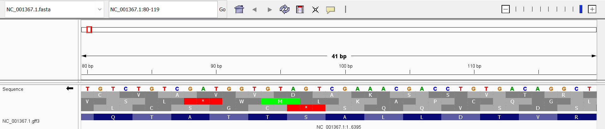
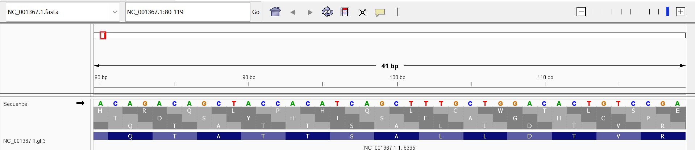

# Week 02 - Tobacco mosaic virus genome data

## Selected genome

This assignment uses the complete RefSeq record for tobacco mosaic virus (TMV),
accession [NC_001367.1](https://www.ncbi.nlm.nih.gov/nuccore/NC_001367.1).
TMV is a positive-sense single-stranded RNA virus. Its complete reference
genome is one linear RNA molecule with **6,395 nucleotides**. It does not have
chromosomes in the cellular sense; for this assignment, the genome is treated
as **one genomic sequence/segment**.

The files are downloaded from NCBI's E-utilities genomic data repository:

- FASTA: `https://eutils.ncbi.nlm.nih.gov/entrez/eutils/efetch.fcgi?db=nuccore&id=NC_001367.1&rettype=fasta&retmode=text`
- GFF3: `https://eutils.ncbi.nlm.nih.gov/entrez/eutils/efetch.fcgi?db=nuccore&id=NC_001367.1&rettype=gff3&retmode=text`

The GFF3 contains **13 annotations/features** when comment and directive lines
are excluded: one region feature, six gene features, and six CDS features.

## Completeness assessment

The NCBI record describes this as a complete genome, and the FASTA contains
the full 6,395-nt reference sequence. The GFF3 annotates all six listed genes
and their coding sequences. I therefore consider this build **complete for a
reference genome**, while noting that it is a single reference isolate and
does not represent the sequence variation found across TMV populations.


## Reproduce the download

This assignment assumes the user is working in the course **bioinfo environment**, with `make` and `curl` available.

To reproduce the data download from a new copy of the repository:

```sh
git clone https://github.com/susansharpe/appbio-2026.git
cd appbio-2026/week02
make
```

If the repository is already cloned, navigate to the `week02` directory and run:

```sh
make
```

The `Makefile` automatically organizes the downloaded data according to file type:

- FASTA files are stored in the `fasta/` directory.
- GFF3 files are stored in the `gff/` directory.

Running `make` downloads the following files:

- `fasta/NC_001367.1.fasta`
- `gff/NC_001367.1.gff3`

The downloaded files can be checked with:

```sh
ls -lh fasta/
ls -lh gff/
```

Running `make` again will not redownload files that already exist.

To remove the downloaded files and reproduce the download from scratch, run:

```sh
make clean
make
```

To count the annotation rows in the GFF3 file, excluding comment and directive lines, run:

```sh
awk '!/^#/ && NF { n++ } END { print n }' gff/NC_001367.1.gff3
```

```markdown
## Genome visualization

### Gene organization

The TMV genome is very tightly packed. There is little to no intergenic space, and several genes appear to overlap. Where genes are separated, the distance appears to be only on the order of tens of nucleotides. This compact organization is characteristic of viral genomes, which often maximize the amount of information encoded in a relatively small genome.

### Sequence inspection and reading frames

I inspected the region **NC_001367.1:80-119** in IGV and displayed the three-frame translation on both strand orientations.

The six possible translated reading frames observed around this region were:

- **CVAVVDAKSSVTR**
- **VSL\*WMLKAPCQGL**
- **LCSGC\*SQQVSDS**
- **HRQLPHQLCWTLSE**
- **TDSYHISFAGHCP**
- **QTATTSALLDTVR**

The asterisks (`*`) represent stop codons. After comparing the six possible reading frames with the GFF3 annotation, **QTATTSALLDTVR** corresponds to the annotated coding frame in this region.





### Annotation track

The GFF3 file is displayed in IGV as an **annotation/feature track**. The file contains region, gene, and CDS features.

### Strand orientation

The annotated gene and CDS features in the TMV GFF3 file are located on the **positive (+) strand**. Because the annotation contains positive-strand features, the positive-strand orientation is the one displayed for these features in IGV.
```
